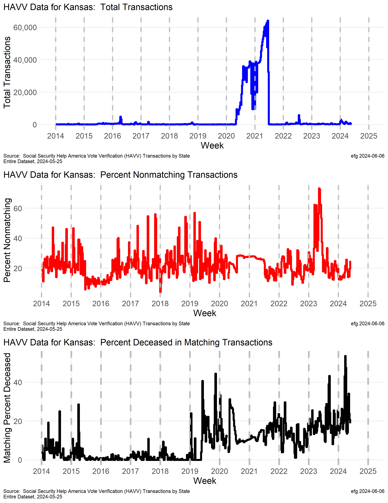
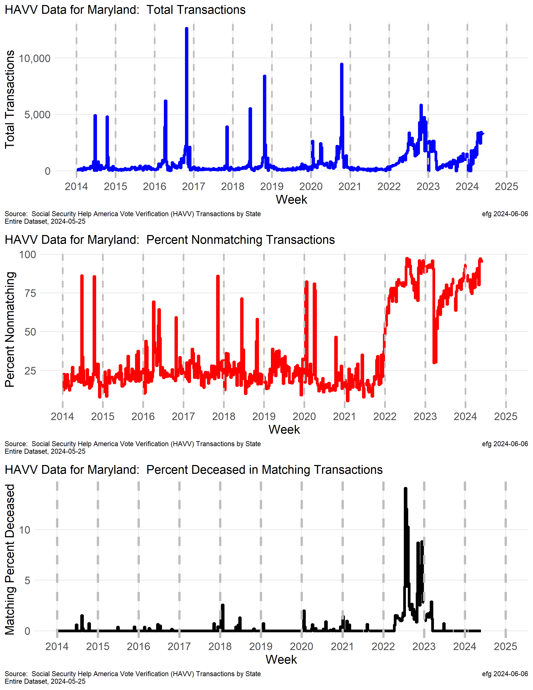
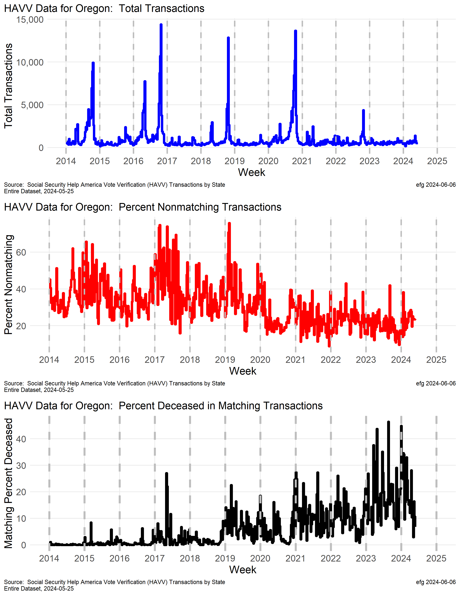
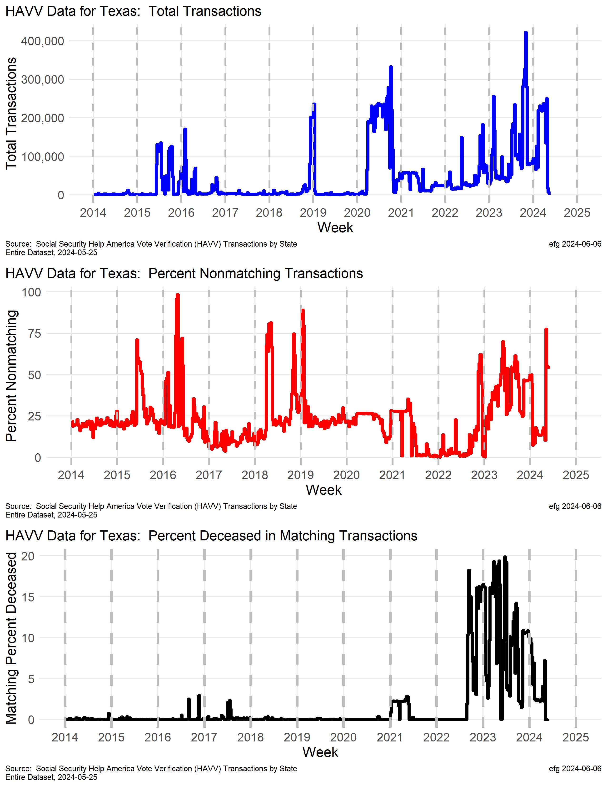

# Help America Vote Verification (HAVV) Analysis

The Social Security Administration provides an Open Government Initiative page with a section about the [Help America Vote Verification (HAVV) Transactions by State](https://www.ssa.gov/open/havv/).

The online data is not useful for analysis. The [Excel file with all the data in over 700 sheets](https://www.ssa.gov/open/havv/havv-weekly-usage.xlsx) is not so useful for direct analysis.

[Info below is from the HAVV page](https://www.ssa.gov/open/havv/).  See this page for more details.

**What is HAVA?**

*The [Help America Vote Act of 2002, P.L. 107-252 (HAVA)](https://www.govinfo.gov/content/pkg/PLAW-107publ252/pdf/PLAW-107publ252.pdf) requires States to verify the information of newly registered voters for Federal elections. Each State must establish a computerized State-wide voter registration list and verify new voter information with the State’s Motor Vehicle Administration (MVA).*

*The States are required to verify the driver’s license number against the state MVA database. Only in situations where no driver’s license exists should the states verify the last four digits of the new voter registrant’s Social Security Number (SSN).*

*The State submits the last digits of the SSN, name, and date of birth to the MVA for verification with SSA. In addition, SSA is required to report whether its records indicate that the registrant is deceased.*

---
# Technical information

This approach starts with the authorative Social Security HAVV data source and provides complete data provenance through the creation of derived files or plots.

## HAVV First Look

The RStudio notebook **HAVV-First-Look.Rmd** downloads the current HAVV Excel file from the Social Security site and provides a first look at the 700+ sheets in the file.

Output files and folders are created in a subfolder with the name of the current sheet (for now the third one in the downloaded Excel file).  The current sheet and subfolder name has format **yyyy-mm-dd** which currently is **2024-05-25**. As HAVV data is updated when new sheets, future runs will automatically create folders with the latest sheet name.  This allows easy comparison over time.

[Many Excel files have a sheetname prefix so they will have distinct names -- this is to avoid a problem since Microsoft does not allow two Excel files with the same to be opened at the same time for comparison.]

The data are explored for "bad" values and inconsistencies.  See R script for details of problem data and fixes applied.  Government data files that are not regularly used in analysis often have a variety of "bad data" issues.

Two summary Excel files are created by the script, a sheet summary and a state summary, as well as composite files and a folder of files by state.

* Sheet summary:  **HAVV-Sheets-Summary-yyyy-mm-dd-Edited.xlsx**

This file was edited to highlight problems in a light red color.  Sheet 2014-01-04 for some reason had 71 rows -- all others had only 57. Six sheets (see 2013-09-07 for example" for some reason have 16138 rows when read by the R script.  These extract columns appear to be blank but can cause problems with binding all the sheets together into a single file.

The *columnNameMatch* shows sheet 2012-08-18 doesn't have exactly the same header as all other sheets.  In this case, the difference can be ignored.

Column *rowNameMatch* shows not all sheets have the same state row names as the most recent sheet.  This doesn't seem to be a problem.

* State summary:  **HAVV-State-Summary-yyyy-mm-dd-Edited.xlsx**

This Excel file summarizes HAVV info by state -- and the District of Columbia.

For some reason Alabama and Hawaii are "off by one" in the number of records compared to other states.  This issue should be explored.  The *Matches* column shows only 4 of the 9 computed columns sum match for these states -- all nine computed sums match in all other states.

The *AllZero* column is TRUE for states with 0s for all sheet dates since they are not using HAVV, including Kentucky, New Mexico, North Dakota, South Carolina, Tennessee, Virginia and West Virginia. Plots are not made for these states in the next section.

Some other states have very low or erratic reporting over time:  Delaware, Mississippi, New Hampshire, Oklahoma, and some others.  Plots may be suppressed for these stats in future runs.

* **Composite files**

All 700+ HAVV sheets are combined into a single sheet in an Excel file -- this file is much easier to use in analysis than the original file.  A separate CSV file with the same content is also created.

  + **HAVV-Through-yyyy-mm-dd.xlsx**

  + **HAVV-Through-2024-05-25.csv**

These files can be filtered or sorted in Excel.

In addition to all the original HAVV data, some percentages are computed, as well as some date variables that may be useful for filtering or plots.

* **State-Data** folder

This folder has one Excel file by state containing all 700+ sheets of summary data for that state in sheet order (an ISO 8601 date).

A filename suffix of "-ALLZERO" is used to identify states not participating in HAVV reporting.

These state files show a row for each of the 700+ original sheets, as well as yearly totals and a *totals-since-2011* row present in the downloaded file.

A final *COMPUTED* row is the sum of all the sheets (excluding the total rows) to verify the file matches the *totals-since-2011* row.

These state files have the same added columns as the composite files.

## HAVV Plots

The RStudio notebook **HAVV-Plot-Template.Rmd** can be use to create a plot for a specific state over a specified range of years using the *parms* in the YAML header.

This template is intended to be used with the **HAVV-Plot-Driver.Rmd** to creat plots in a subfolder **States-Plots**, which will contain a combination of PNG and PDF graphics files.

The template notebook reads the composite file **HAVV-Through-yyyy-mm-dd.xlsx** for the HAVV data to create all plots.

The current driver notebook finds the most current yyyy-mdd-dd subfolder automatically.

Columns in the state summary are used to suppress creation of plots for state not using HAVV.

TO DO:  The year grid lines in the composite ggplot do not quite align across all three subplots.  The goal is to make the year lines align across plots for easier comparisons.

---
# Analysis

---
### Illinois

---
### Kansas

---
### Maryland

---
### New York

---
### Oregon

---
### Texas

---
Acknowledgement:  Thanks to the Lone Racoon for his pioneering work on HAVV.
